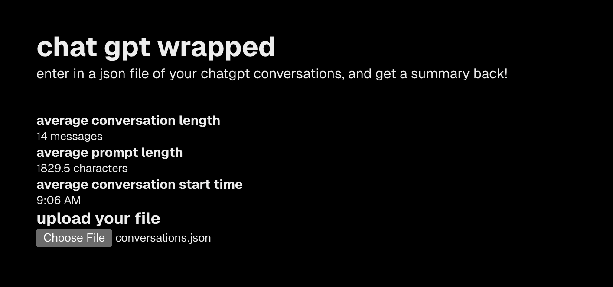

# chat gpt wrapped
## a website with statistics on your chatgpt usage!

i made this website to take advantage of the fact that you can
export your chatgpt data into a json file really easily. i was inspired
by a discussion during an ai ethics class, and i started this project.
the website is definitely barebones, and i want to add more statistics in the future.

### usage
1. go to chatgpt
2. go to settings
3. go to privacy
4. export your data
5. unzip the files
6. upload "conversations.json" from the folder

check it out at https://chat-gpt-wrapped-three.vercel.app/

